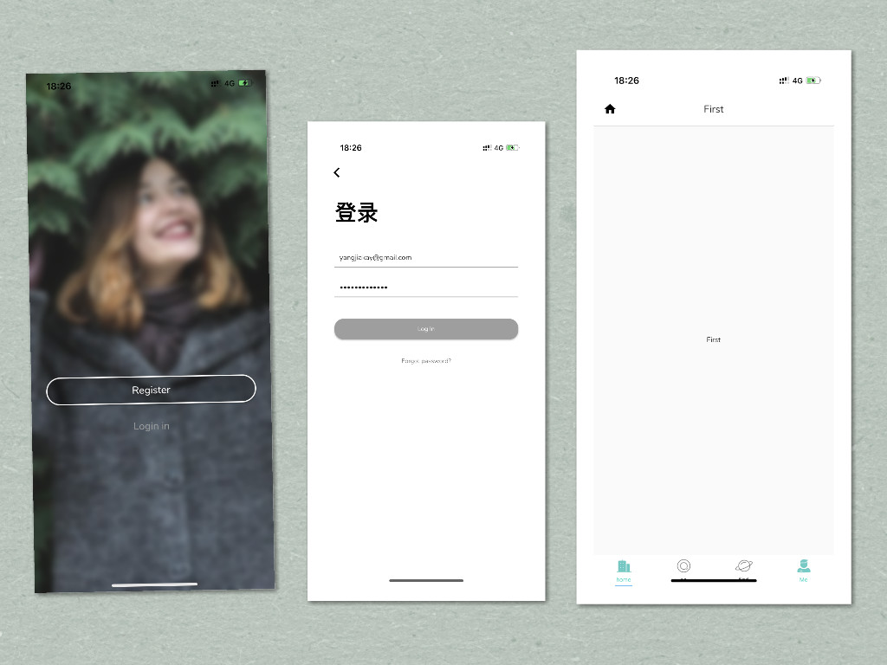

# Flutter_CommonApp

[README in english](README-EN.md)

打造一款通用的AppUI结构，包括登录、注册、首页及各中共用部分，目前还在完善，希望大家一起加入。

引用我在[AndroidEfficientBaseUtils](https://github.com/MeandNi/AndroidEfficientBaseUtils)说过的话相当于给你一个完完整整地漂亮的盒子，你只需吧自己需要的东西放进去就好。

